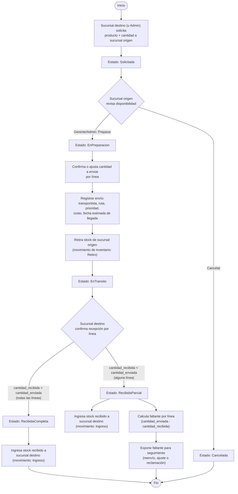

# Diagrama de Actividad — Flujo de Transferencia entre Sucursales

Cubre el ciclo completo descrito en §3.4 del PDF: solicitud → preparación → envío →
recepción completa o parcial. Corresponde a `TransferenciasController` /
`TransferenciaService` en el backend.

## Notas

- Los estados persisten en `transferencias.estado` (`ENUM`) y determinan qué acción es
  válida en cada momento — el backend rechaza transiciones inválidas (p. ej. no se puede
  "enviar" una transferencia que sigue en `Solicitada`).
- El retiro de stock ocurre al **registrar el envío** (no antes), y el ingreso ocurre al
  **confirmar la recepción** — el stock "en tránsito" no está disponible ni en origen ni en
  destino durante ese intervalo, lo cual se refleja en el dashboard como "cantidad total en
  tránsito" (`TransferenciaActivaDto.CantidadTotalEnTransito`).
- La decisión de tratamiento ante un faltante (reenvío, ajuste, reclamación) queda como una
  decisión operativa fuera del sistema; el sistema solo calcula y expone el faltante para
  que el gerente decida.
