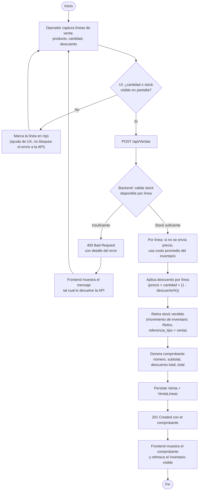

# Diagrama de Actividad — Flujo de Venta

Cubre §3.3 del PDF: validación de stock → registro → comprobante. Corresponde a
`VentasController` / `VentaService` en el backend, con validación de UX espejo (no
autoritativa) en `Frontend/src/pages/VentasPage.tsx`.

## Notas

- La validación de stock en el frontend (`stockPorProducto` en `VentasPage.tsx`) es
  puramente una ayuda de UX construida sobre el inventario ya cargado en pantalla — el
  backend (`VentaService`) es la única autoridad real y vuelve a validar de forma
  independiente antes de confirmar, cumpliendo la restricción §5 de "no lógica de negocio
  en el cliente".
- El precio unitario es opcional por línea: si no se envía (o es `0`), el backend usa el
  costo promedio del inventario de ese producto en esa sucursal como precio base
  (`CrearVentaLineaDto.PrecioUnitario: decimal?`).
- El retiro de stock y la generación del comprobante ocurren en la misma transacción del
  backend — si el stock no alcanza, no se genera ningún movimiento ni comprobante parcial.
