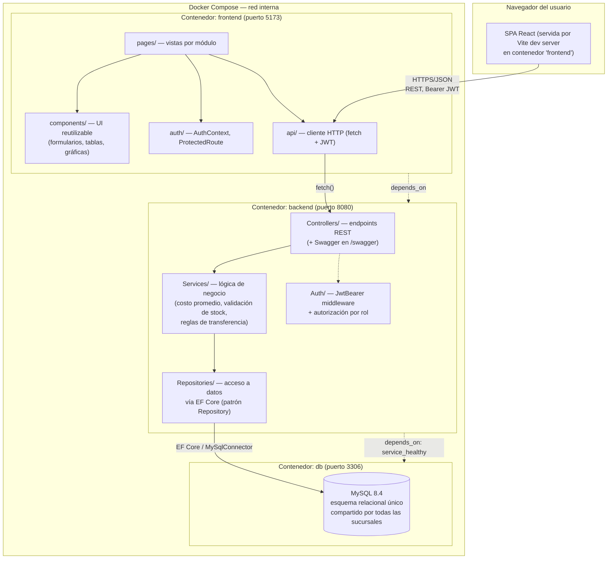

# Diagrama de Arquitectura

Vista técnica del sistema: capas, servicios Docker y su comunicación (§7.1 y §8.1 del PDF).

## Capas y responsabilidades

| Capa | Contenedor | Responsabilidad | Tecnología |
|---|---|---|---|
| **Presentación** | `frontend` | Renderizar UI, manejar sesión local, consumir la API — sin lógica de negocio propia | React 19 + TypeScript + Vite + react-router-dom |
| **Negocio** | `backend` | Validaciones, reglas de transferencia, cálculo de costo promedio ponderado, autenticación/autorización, generación de reportes agregados | ASP.NET Core 9 Web API (C#) |
| **Datos** | `db` | Almacenamiento persistente, integridad referencial (FKs), constraints de unicidad | MySQL 8.4 |

## Comunicación entre capas

- El frontend **nunca** accede a la base de datos directamente ni implementa las reglas de
  negocio del backend (costo promedio, validación de stock, cálculo de faltantes): solo
  llama a la API REST del backend y renderiza su respuesta.
- El backend expone únicamente HTTP/JSON REST (documentado con Swagger en `/swagger`),
  autenticado con JWT Bearer. No expone la base de datos directamente a ningún cliente.
- Los tres contenedores están definidos en `docker-compose.yaml`, en la misma red interna
  de Docker Compose, con `depends_on` + healthcheck para garantizar el orden de arranque
  (`db` → `backend` → `frontend`) sin pasos manuales.

Ver `docs/decisiones-tecnicas.md` para la justificación de cada elección tecnológica.
