# Diagrama de Casos de Uso

Actores (§6.2 del PDF) contra los módulos funcionales (§3) implementados. El actor
"Sistema externo" es opcional y no está implementado; se muestra para completar el modelo
de actores del PDF.

```mermaid
flowchart LR
    Admin["Administrador general"]
    Gerente["Gerente de sucursal"]
    Operador["Operador de inventario"]
    Externo["Sistema externo (opcional, no implementado)"]

    subgraph Auth[Autenticación]
        UC1(("Iniciar sesión"))
    end

    subgraph Inv[Inventario]
        UC2(("Consultar catálogo propio"))
        UC3(("Consultar inventario de otra sucursal"))
        UC4(("Registrar ingreso / retiro"))
        UC5(("Ver alertas de stock mínimo"))
    end

    subgraph Compras[Compras]
        UC6(("Crear orden de compra"))
        UC7(("Confirmar recepción de orden"))
        UC8(("Consultar histórico de compras"))
    end

    subgraph Ventas[Ventas]
        UC9(("Registrar venta"))
        UC10(("Consultar comprobante de venta"))
    end

    subgraph Transf[Transferencias]
        UC11(("Solicitar transferencia"))
        UC12(("Preparar y enviar transferencia"))
        UC13(("Confirmar recepción completa/parcial"))
        UC14(("Cancelar transferencia"))
    end

    subgraph Log[Logística]
        UC15(("Consultar tiempos y rutas"))
        UC16(("Consultar cumplimiento logístico"))
    end

    subgraph Dash[Dashboard]
        UC17(("Ver KPIs de su sucursal"))
        UC18(("Ver comparativa entre sucursales"))
    end

    subgraph Admin_[Administración]
        UC19(("Gestionar usuarios y sucursales"))
    end

    Admin --> UC1
    Gerente --> UC1
    Operador --> UC1

    Admin --> UC2
    Admin --> UC3
    Admin --> UC4
    Admin --> UC5
    Gerente --> UC2
    Gerente --> UC3
    Gerente --> UC4
    Gerente --> UC5
    Operador --> UC2
    Operador --> UC3
    Operador --> UC4
    Operador --> UC5

    Admin --> UC6
    Admin --> UC7
    Admin --> UC8
    Gerente --> UC6
    Gerente --> UC7
    Gerente --> UC8

    Admin --> UC9
    Admin --> UC10
    Gerente --> UC9
    Gerente --> UC10
    Operador --> UC9
    Operador --> UC10

    Admin --> UC11
    Admin --> UC12
    Admin --> UC13
    Admin --> UC14
    Gerente --> UC11
    Gerente --> UC12
    Gerente --> UC13
    Gerente --> UC14
    Operador --> UC11
    Operador --> UC13

    Admin --> UC15
    Admin --> UC16
    Gerente --> UC15
    Gerente --> UC16
    Operador --> UC15

    Admin --> UC17
    Admin --> UC18
    Gerente --> UC17
    Operador --> UC17

    Admin --> UC19

    Externo -. "vía API REST (Swagger)" .-> UC2
    Externo -. "vía API REST (Swagger)" .-> UC9
```

## Notas

- **Solo `Administrador general`** tiene acceso a `Gestionar usuarios y sucursales` y a
  `Ver comparativa entre sucursales` — reflejado en el backend como
  `[Authorize(Roles = Roles.Admin)]` en `UsuariosController`, `SucursalesController`
  (escritura) y `DashboardController.GetComparativaSucursales`.
- **`Preparar y enviar transferencia`** está restringido a `Administrador general` y
  `Gerente de sucursal` (`Roles.AdminYGerente`) porque el PDF asigna la aprobación de
  transferencias al gerente de sucursal (§6.2).
- **`Confirmar recepción`** está disponible para cualquier rol autenticado en la sucursal
  destino, ya que operativamente cualquier operador puede recibir mercancía.
- El resto de los casos de uso (inventario, ventas, compras, logística, dashboard propio)
  están disponibles para los 3 roles, ya que son parte de la operación diaria de cualquier
  usuario de una sucursal.
