# Diagrama Entidad-Relación (E-R)

Modelo relacional completo, generado a partir de `Database/init/01_schema.sql` (fuente de
verdad del esquema). Los enums de MySQL (`rol`, `tipo`, `estado`, `prioridad`) se muestran
como columnas con su dominio de valores entre paréntesis.

```mermaid
erDiagram
    SUCURSALES ||--o{ USUARIOS : "emplea"
    SUCURSALES ||--o{ INVENTARIO : "almacena"
    SUCURSALES ||--o{ MOVIMIENTOS_INVENTARIO : "registra"
    SUCURSALES ||--o{ ORDENES_COMPRA : "recibe"
    SUCURSALES ||--o{ VENTAS : "origina"
    SUCURSALES ||--o{ TRANSFERENCIAS : "envia (origen)"
    SUCURSALES ||--o{ TRANSFERENCIAS : "recibe (destino)"
    SUCURSALES ||--o{ RUTAS_LOGISTICAS : "origen de"
    SUCURSALES ||--o{ RUTAS_LOGISTICAS : "destino de"
    SUCURSALES ||--o{ VISITAS : "recibe"

    USUARIOS ||--o{ MOVIMIENTOS_INVENTARIO : "responsable de"
    USUARIOS ||--o{ ORDENES_COMPRA : "crea"
    USUARIOS ||--o{ VENTAS : "registra"
    USUARIOS ||--o{ TRANSFERENCIAS : "solicita"
    USUARIOS ||--o{ VISITAS : "registra"

    UNIDADES_MEDIDA ||--o{ PRODUCTOS : "unidad base de"
    UNIDADES_MEDIDA ||--o{ PRODUCTO_UNIDADES_MEDIDA : "es unidad alternativa"

    PRODUCTOS ||--o{ PRODUCTO_UNIDADES_MEDIDA : "tiene alternativas"
    PRODUCTOS ||--o{ INVENTARIO : "tiene stock en"
    PRODUCTOS ||--o{ MOVIMIENTOS_INVENTARIO : "afecta"
    PRODUCTOS ||--o{ ORDENES_COMPRA_LINEAS : "se compra en"
    PRODUCTOS ||--o{ VENTAS_LINEAS : "se vende en"
    PRODUCTOS ||--o{ TRANSFERENCIAS_LINEAS : "se transfiere en"

    PROVEEDORES ||--o{ ORDENES_COMPRA : "provee"

    ORDENES_COMPRA ||--o{ ORDENES_COMPRA_LINEAS : "contiene"
    VENTAS ||--o{ VENTAS_LINEAS : "contiene"
    TRANSFERENCIAS ||--o{ TRANSFERENCIAS_LINEAS : "contiene"

    SUCURSALES {
        int id PK
        string nombre
        string direccion
        string ciudad
        string telefono
        bool activa
        datetime created_at
    }

    USUARIOS {
        int id PK
        int sucursal_id FK "NULL para Admin general"
        string nombre
        string email UK
        string password_hash
        enum rol "administrador_general | gerente_sucursal | operador_inventario"
        bool activo
        datetime created_at
    }

    UNIDADES_MEDIDA {
        int id PK
        string nombre
        string abreviatura UK
    }

    PRODUCTOS {
        int id PK
        int unidad_medida_id FK
        string sku UK
        string nombre
        string descripcion
        string categoria
        bool activo
        datetime created_at
    }

    PRODUCTO_UNIDADES_MEDIDA {
        int id PK
        int producto_id FK
        int unidad_medida_id FK
        decimal factor_conversion "unidades base por 1 unidad alt."
    }

    INVENTARIO {
        int id PK
        int producto_id FK
        int sucursal_id FK
        decimal cantidad
        decimal stock_minimo
        decimal costo_promedio
        datetime updated_at
    }

    MOVIMIENTOS_INVENTARIO {
        int id PK
        int producto_id FK
        int sucursal_id FK
        int usuario_id FK
        enum tipo "ingreso | retiro"
        decimal cantidad
        string motivo
        string referencia_tipo "compra | venta | transferencia | ajuste"
        int referencia_id
        datetime fecha
    }

    PROVEEDORES {
        int id PK
        string nombre
        string contacto
        string telefono
        string email
        string direccion
        bool activo
        datetime created_at
    }

    ORDENES_COMPRA {
        int id PK
        int proveedor_id FK
        int sucursal_id FK
        int usuario_id FK
        enum estado "pendiente | confirmada | recibida | cancelada"
        int plazo_pago_dias
        datetime fecha
        datetime fecha_recepcion
    }

    ORDENES_COMPRA_LINEAS {
        int id PK
        int orden_compra_id FK
        int producto_id FK
        decimal cantidad
        decimal precio_unitario
        decimal descuento "porcentaje"
    }

    VENTAS {
        int id PK
        int sucursal_id FK
        int usuario_id FK
        string numero_comprobante UK
        decimal subtotal
        decimal descuento_total
        decimal total
        datetime fecha
    }

    VENTAS_LINEAS {
        int id PK
        int venta_id FK
        int producto_id FK
        decimal cantidad
        decimal precio_unitario
        decimal descuento "porcentaje"
    }

    TRANSFERENCIAS {
        int id PK
        int sucursal_origen_id FK
        int sucursal_destino_id FK
        int usuario_solicitante_id FK
        enum estado "solicitada | en_preparacion | en_transito | recibida_completa | recibida_parcial | cancelada"
        string transportista
        string ruta
        enum prioridad "baja | media | alta"
        decimal costo_envio
        datetime fecha_solicitud
        datetime fecha_envio
        datetime fecha_estimada_llegada
        datetime fecha_recepcion
    }

    TRANSFERENCIAS_LINEAS {
        int id PK
        int transferencia_id FK
        int producto_id FK
        decimal cantidad_solicitada
        decimal cantidad_enviada
        decimal cantidad_recibida
    }

    VISITAS {
        int id PK
        int sucursal_id FK
        int usuario_id FK
        int cantidad_personas "check >= 1"
        datetime fecha_hora
    }

    RUTAS_LOGISTICAS {
        int id PK
        int sucursal_origen_id FK
        int sucursal_destino_id FK
        string transportista "default 'Coordinadora'"
        decimal costo_envio
        int tiempo_estimado_dias
    }
```

## Notas de diseño

- **`inventario`** es la tabla de stock por sucursal (`UNIQUE(producto_id, sucursal_id)`):
  un producto tiene como máximo un registro de stock por sucursal, lo que permite que cada
  sucursal opere de forma autónoma sobre su propio nivel de inventario.
- **`movimientos_inventario`** es la tabla de trazabilidad exigida por el PDF (§3.1): cada
  ingreso o retiro queda registrado con fecha, responsable (`usuario_id`), motivo y
  cantidad, y puede referenciar el documento que lo originó (`referencia_tipo` +
  `referencia_id` → una compra, una venta o una transferencia).
- **`producto_unidades_medida`** implementa unidades de medida alternativas (T35): un
  producto tiene una unidad base (`productos.unidad_medida_id`) y puede tener N unidades
  alternativas con su factor de conversión (p. ej. "caja" = 12 "unidades").
- Los estados de `ordenes_compra` y `transferencias` están modelados como `ENUM` en MySQL
  en vez de tablas de catálogo separadas: son conjuntos cerrados y pequeños definidos por
  la lógica de negocio del backend (`Backend/Models/EstadoOrdenCompra.cs`,
  `EstadoTransferencia.cs`), no datos configurables por el usuario.
- **`visitas`** (funcionalidad adicional, §4 del PDF) representa un *grupo* que ingresa a
  la sucursal, no una persona individual: `cantidad_personas` (con `CHECK >= 1`) cuenta
  cuántas personas trae ese grupo. No tiene tabla de líneas porque no hay nada que
  desglosar por producto — es una entidad simple de registro/auditoría, análoga en espíritu
  a `movimientos_inventario` pero para el flujo físico de personas en vez de mercancía.
